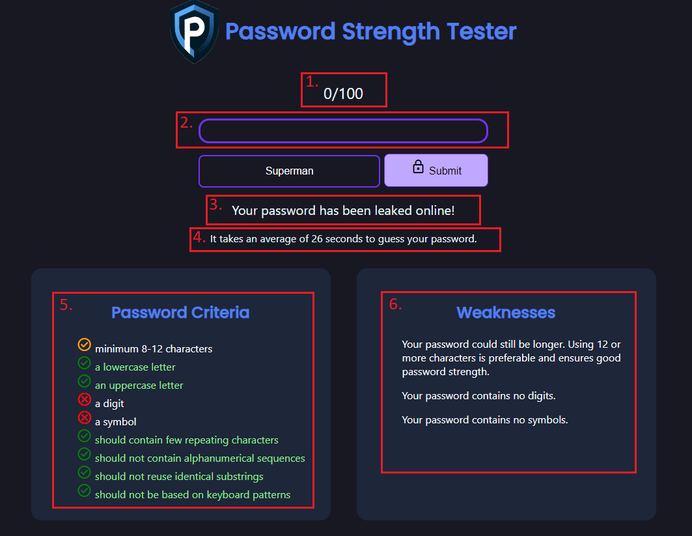

# Password-Strength-Meter-Tool
The password strength tester is a previous school deliverable that has been revised. The web application is a learning tool created to allow for the testing of password strength, as well as promote good password hygiene in the form of additional information and tips regarding how to make strong passwords and possible consequences of taking passwords lightly.

The project is mainly split into two directions. The first is the mathematical computation of password strength, and utilizes concepts from information theory and binary entropy in order to derive at a single number responsible of communicating password strength. The second is how the result is communicated effectively to the end user, and this takes into account the end users' likely technical understanding, the use of colours and visual elements, and limited jargon in order to make the learning content more easily digestible.

# Overview
Password strength is based on three things, heuristic factors, binary entropy, and reductions in password score based on predictability and the use of patterns.

# Note
Due to file size restrictions, I was unable to upload the rockyou dataset which was used in the program in order to filter the user input for previously leaked passwords. To use this utility then simply download a similar .txt file into the same repository as the other files. The filename might have to be changed in order to be correctly fetched by the rockyouWeakness function in the script.js file.

### Figure 1 - Strength Meter Overview

**Description:**
Figure 1 demonstrates:
1. Entropy-based password scoring
2. Dynamic strength meter visualization
3. RockYou dataset lookup
4. Estimated cracking time
5. Character requirement checklist
6. Weakness feedback analysis
